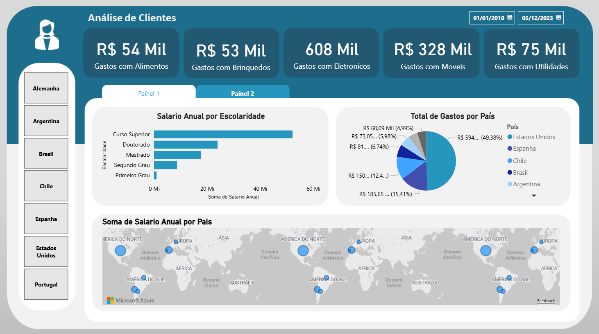

📊 Projeto de BI - Análise de Clientes

## 🎯 Objetivo
Analisar dados de clientes para identificar padrões e oportunidades de crescimento.

## 📂 Dados
Fonte: Kaggle

## 🛠️ Ferramentas
- Power BI

## 📈 Análises realizadas
Paínel 1:
- Gastos por pordutos (Alimentos, Brinquedos, Eletronicos, Moveis e Utilidades)
- Salário Anual por escolaridades
- Total de gastos por País
- Soma de salario anual por País

Paínel 2:
- Gastos por pordutos (Alimentos, Brinquedos, Eletronicos, Moveis e Utilidades)
- Soma de salário anual por estado civíl
- Escolaridade por estado civíl
- Soma de total por País, Escolaridade e Estado Civíl
  
## 📸 Dashboard

## 🚀 Como abrir
Baixe o arquivo .pbix e abra no Power BI
